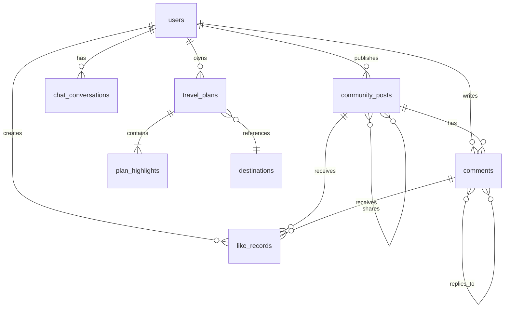

# 数据库表结构文档

> 版本：v1.0  
> 更新时间：2026-05-10  
> 数据库类型：MySQL 8.x

---

## 目录

- [概述](#概述)
- [表结构详情](#表结构详情)
  - [users（用户表）](#users-用户表)
  - [travel_plans（旅行计划表）](#travel_plans-旅行计划表)
  - [plan_highlights（旅行计划亮点表）](#plan_highlights-旅行计划亮点表)
  - [destinations（目的地表）](#destinations-目的地表)
  - [chat_conversations（聊天会话表）](#chat_conversations-聊天会话表)
  - [community_posts（社区帖子表）](#community_posts-社区帖子表)
  - [comments（评论表）](#comments-评论表)
  - [like_records（点赞记录表）](#like_records-点赞记录表)
- [ER 关系图](#er-关系图)
- [索引设计](#索引设计)

---

## 概述

本系统采用 MySQL 8.x 数据库，包含 8 张核心业务表，涵盖用户管理、旅行计划、目的地、社区互动等功能模块。

---

## 表结构详情

### users（用户表）

| 字段名 | 类型 | 约束 | 说明 |
| :--- | :--- | :--- | :--- |
| id | BIGINT | PRIMARY KEY, AUTO_INCREMENT | 用户唯一标识 |
| username | VARCHAR(50) | NOT NULL, UNIQUE | 用户名 |
| password | VARCHAR(255) | NOT NULL | 加密后的密码 |
| email | VARCHAR(100) | NULL | 邮箱地址 |
| phone | VARCHAR(20) | NULL | 手机号码 |
| profile_pic_url | VARCHAR(255) | NULL | 头像URL |
| bio | VARCHAR(200) | NULL | 个人简介 |
| created_at | DATETIME | NOT NULL | 创建时间 |
| updated_at | DATETIME | NULL | 更新时间 |

**索引**:
- `idx_users_username` (username)
- `idx_users_email` (email)

---

### travel_plans（旅行计划表）

| 字段名 | 类型 | 约束 | 说明 |
| :--- | :--- | :--- | :--- |
| id | BIGINT | PRIMARY KEY, AUTO_INCREMENT | 计划唯一标识 |
| user_id | BIGINT | NOT NULL | 所属用户ID |
| title | VARCHAR(255) | NOT NULL | 计划标题 |
| destination_id | BIGINT | NULL | 目的地ID |
| destination_name | VARCHAR(100) | NULL | 目的地名称 |
| days | INT | NOT NULL | 旅行天数 |
| itinerary | LONGTEXT | NULL | 行程内容（JSON格式） |
| estimated_budget | DECIMAL(10,2) | NULL | 预估预算 |
| ai_confidence_score | DECIMAL(3,2) | NULL | AI生成置信度 |
| interests | VARCHAR(255) | NULL | 用户兴趣标签 |
| travel_style | VARCHAR(50) | NULL | 旅行风格 |
| status | VARCHAR(20) | DEFAULT 'draft' | 状态：draft/published/completed |
| start_date | DATE | NULL | 出发日期 |
| created_at | DATETIME | NOT NULL | 创建时间 |
| updated_at | DATETIME | NULL | 更新时间 |

**索引**:
- `idx_travel_plans_user_id` (user_id)
- `idx_travel_plans_destination_id` (destination_id)
- `idx_travel_plans_status` (status)

---

### plan_highlights（旅行计划亮点表）

| 字段名 | 类型 | 约束 | 说明 |
| :--- | :--- | :--- | :--- |
| id | BIGINT | PRIMARY KEY, AUTO_INCREMENT | 亮点唯一标识 |
| plan_id | BIGINT | NOT NULL, FOREIGN KEY | 关联旅行计划ID |
| highlight_text | VARCHAR(500) | NOT NULL | 亮点描述 |
| category | VARCHAR(50) | NULL | 类别：food/attraction/accommodation |

**索引**:
- `idx_plan_highlights_plan_id` (plan_id)

---

### destinations（目的地表）

| 字段名 | 类型 | 约束 | 说明 |
| :--- | :--- | :--- | :--- |
| id | BIGINT | PRIMARY KEY, AUTO_INCREMENT | 目的地唯一标识 |
| name | VARCHAR(100) | NOT NULL | 目的地名称 |
| description | TEXT | NOT NULL | 目的地描述 |
| rating | DECIMAL(3,2) | NULL | 评分（0-5） |
| review_count | INT | NULL | 评论数量 |
| image_url | VARCHAR(255) | NULL | 封面图片URL |
| latitude | DECIMAL(10,8) | NULL | 纬度 |
| longitude | DECIMAL(11,8) | NULL | 经度 |
| country | VARCHAR(50) | NULL | 国家 |
| region | VARCHAR(100) | NULL | 地区/省份 |
| created_at | DATETIME | NOT NULL | 创建时间 |
| updated_at | DATETIME | NULL | 更新时间 |

**索引**:
- `idx_destinations_name` (name)
- `idx_destinations_country` (country)
- `idx_destinations_region` (region)

---

### chat_conversations（聊天会话表）

| 字段名 | 类型 | 约束 | 说明 |
| :--- | :--- | :--- | :--- |
| id | BIGINT | PRIMARY KEY, AUTO_INCREMENT | 会话唯一标识 |
| user_id | BIGINT | NOT NULL | 所属用户ID |
| title | VARCHAR(200) | NULL | 会话标题 |
| messages_json | LONGTEXT | NULL | 消息记录（JSON格式） |
| result_json | LONGTEXT | NULL | 对话结果（JSON格式） |
| created_at | DATETIME | NOT NULL | 创建时间 |
| updated_at | DATETIME | NOT NULL | 更新时间 |

**索引**:
- `idx_chat_conversations_user_id` (user_id)

---

### community_posts（社区帖子表）

| 字段名 | 类型 | 约束 | 说明 |
| :--- | :--- | :--- | :--- |
| id | BIGINT | PRIMARY KEY, AUTO_INCREMENT | 帖子唯一标识 |
| title | VARCHAR(255) | NOT NULL | 帖子标题 |
| description | TEXT | NULL | 帖子内容 |
| images | TEXT | NULL | 图片URL（JSON数组格式） |
| likes | INT | DEFAULT 0 | 点赞数 |
| comments | INT | DEFAULT 0 | 评论数 |
| shares | INT | DEFAULT 0 | 分享数 |
| tags | TEXT | NULL | 标签（逗号分隔） |
| original_post_id | BIGINT | NULL | 原帖ID（分享场景） |
| user_id | BIGINT | NOT NULL | 发布用户ID |
| created_at | DATETIME | NOT NULL | 创建时间 |
| updated_at | DATETIME | NOT NULL | 更新时间 |

**索引**:
- `idx_community_posts_user_id` (user_id)
- `idx_community_posts_created_at` (created_at)

---

### comments（评论表）

| 字段名 | 类型 | 约束 | 说明 |
| :--- | :--- | :--- | :--- |
| id | BIGINT | PRIMARY KEY, AUTO_INCREMENT | 评论唯一标识 |
| post_id | BIGINT | NOT NULL, FOREIGN KEY | 关联帖子ID |
| user_id | BIGINT | NOT NULL | 评论用户ID |
| content | TEXT | NOT NULL | 评论内容 |
| parent_comment_id | BIGINT | NULL | 父评论ID（回复场景） |
| created_at | DATETIME | NOT NULL | 创建时间 |

**索引**:
- `idx_comments_post_id` (post_id)
- `idx_comments_user_id` (user_id)
- `idx_comments_parent_id` (parent_comment_id)

---

### like_records（点赞记录表）

| 字段名 | 类型 | 约束 | 说明 |
| :--- | :--- | :--- | :--- |
| id | BIGINT | PRIMARY KEY, AUTO_INCREMENT | 记录唯一标识 |
| user_id | BIGINT | NOT NULL | 用户ID |
| target_type | VARCHAR(20) | NOT NULL | 目标类型：post/comment |
| target_id | BIGINT | NOT NULL | 目标ID |
| created_at | DATETIME | NOT NULL | 创建时间 |

**索引**:
- `idx_like_records_user_id` (user_id)
- `idx_like_records_target` (target_type, target_id)

---

## ER 关系图



---

## 索引设计

### 主键索引（Primary Key）
- 所有表的 `id` 字段均为主键，自动递增

### 外键索引（Foreign Key）
| 表名 | 外键字段 | 关联表 |
| :--- | :--- | :--- |
| travel_plans | user_id | users(id) |
| travel_plans | destination_id | destinations(id) |
| plan_highlights | plan_id | travel_plans(id) |
| chat_conversations | user_id | users(id) |
| community_posts | user_id | users(id) |
| community_posts | original_post_id | community_posts(id) |
| comments | post_id | community_posts(id) |
| comments | user_id | users(id) |
| comments | parent_comment_id | comments(id) |
| like_records | user_id | users(id) |

### 查询优化索引
- `idx_users_username` - 用户登录查询
- `idx_users_email` - 邮箱找回密码
- `idx_travel_plans_user_id` - 查询用户旅行计划
- `idx_community_posts_created_at` - 按时间排序帖子
- `idx_destinations_name` - 目的地搜索

---

## 数据字典

### 状态枚举

| 表名 | 字段 | 枚举值 | 说明 |
| :--- | :--- | :--- | :--- |
| travel_plans | status | draft, published, completed | 计划状态 |
| like_records | target_type | post, comment | 点赞目标类型 |
| plan_highlights | category | food, attraction, accommodation | 亮点类别 |

---

## 数据库连接信息

```properties
# 生产环境配置示例
spring.datasource.url=jdbc:mysql://localhost:3306/travel_planning_db?useSSL=false&serverTimezone=UTC&allowPublicKeyRetrieval=true&characterEncoding=UTF-8
spring.datasource.username=root
spring.datasource.password=******
spring.jpa.hibernate.ddl-auto=validate
```

---

**文档版本**: v1.0  
**最后更新**: 2026-05-10  
