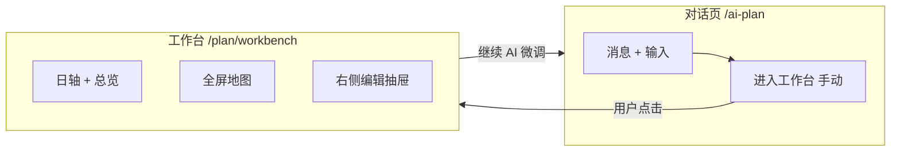
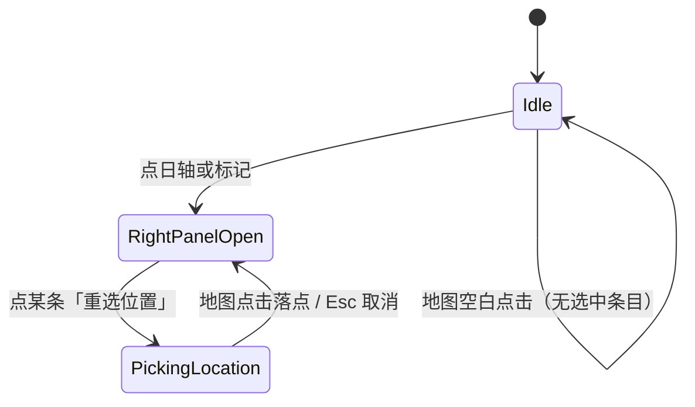

# 规划工作台界面设计

> **状态**：设计已确认（§九），待按 §十一 修改计划实施  
> **关联**：[会话内计划微调改造计划.md](./会话内计划微调改造计划.md)  
> **当前代码**：`/ai-plan` = 对话 + 右侧窄栏地图/行程（`AIPlanView.vue`）

---

## 一、核心目标

生成规划后，用户可**手动进入**独立工作台大页（非自动跳转），在全屏地图上查看与编辑行程；与对话页共享同一会话的 `currentPlan`，往返不丢进度。

| 能力 | 说明 |
|------|------|
| 全屏地图 | 主视野，按天展示地点标记 |
| 顶部日轴 | 按天切换；选中天 → 对应点高亮 |
| **右侧编辑区** | 点日轴 / 点地图标记 → 从右侧滑出或展开编辑 |
| 计划总览 | 顶部可折叠，不占地图主区域 |
| 回到对话 | 「继续 AI 微调」；用户可能不看工作台即在对话里驳回/修改 |
| 条目化编辑 | **天 + 多条活动**，自由增删；AI 或用户填写 |
| 地点绑定 | 编辑区内改地点；**「重选位置」** 进入标点模式 |

---

## 二、已确认产品决策（原 §九）

| # | 决策 | 说明 |
|---|------|------|
| 1 | **未选条目时点地图 = 无操作** | 视为正常行为，**不提示** |
| 2 | **不强制三时段** | 采用 **天 + 条目（activities）**；条目可自由添加，内容由用户或 AI 填写 |
| 3 | **手动进入工作台** | `finish` 后仅在对话页展示 CTA，**不自动跳转**（用户可能不看地图就在对话里继续改） |
| 4 | **编辑区在右侧** | 点击地图标记、日轴某天 → **右侧**出现/聚焦编辑面板（非左侧） |

### 地点与标点模式（决策 1 补充）

- 地点在**右侧编辑区**的条目里编辑（名称、时间、描述等）。
- 每条活动提供 **「重选位置」** 按钮 → 进入 **标点模式**（地图光标/提示态）→ 用户在地图上点击 → 更新该条目的 `lat/lng`（及必要时 `location`）。
- 地图顶栏 **搜索** 可在标点模式下辅助定位；落点仍绑定到**当前正在重选的那一条**。
- 未点击「重选位置」时，地图空白点击 **无效、无 Toast**。

---

## 三、信息架构



| 路径 | 职责 |
|------|------|
| `/ai-plan?c={id}` | 对话、生成、追问；无右侧地图栏 |
| `/plan/workbench?c={id}` | 地图 + 日轴 + 右侧编辑 |

数据源：同一会话 `currentPlan`（`useConversation` / `result`），`persist()` 同步 localStorage + `chat_conversations`。

---

## 四、工作台布局（桌面 · 右栏编辑）

```
┌──────────────────────────────────────────────────────────────────────────┐
│ [← 返回对话]  东京一日游          [保存] [继续 AI 微调]    [计划总览 ▼]   │
├──────────────────────────────────────────────────────────────────────────┤
│ 日轴:  [ D1 ● ] — [ D2 ○ ] — [ D3 ○ ] — [ ＋ ]     （总览展开时在下方）    │
├────────────────────────────────────────────┬─────────────────────────────┤
│  🔍 搜索地点（地图左上，标点模式时高亮）      │  右侧编辑区 360～420px       │
│                                            │  ┌ 第 2 天 ─────────────┐  │
│                                            │  │ + 添加条目            │  │
│         全屏地图 + 标记                     │  │ ┌──────────────────┐ │  │
│         · 选中日高亮                        │  │ │09:00 涩谷         │ │  │
│         · 标点模式：十字/提示条              │  │ │[重选位置] [删除]  │ │  │
│                                            │  │ │描述、贴士、费用…   │ │  │
│                                            │  │ └──────────────────┘ │  │
│                                            │  │ …更多条目…           │  │
│                                            │  └──────────────────────┘  │
└────────────────────────────────────────────┴─────────────────────────────┘
```

**布局要点**

- 地图占据除右栏外的全部区域（flex: 1）。
- 右栏默认：选中天或标记后 **滑入/展开**；无选中时可收起为细条或显示「请选择一天或地图上的地点」。
- 日轴、顶栏固定；总览折叠块可在日轴下方展开，不挡地图主体。

**窄屏（`<900px`）**

- 右栏改为 **底部 Sheet**（仍从「右侧逻辑」变为全宽底栏，交互一致：点轴/点标 → 拉起编辑）。
- 或 Tab：地图 | 行程（二选一全屏），日轴始终可见。

---

## 五、交互规格

### 5.1 进入工作台（手动）

| 时机 | UI |
|------|-----|
| Agent `finish` 且解析出 `currentPlan` | 对话流下方/结果卡片：**「进入工作台查看地图」**（主按钮） |
| 用户未点击 | 留在对话页，可继续自然语言驳回/微调 |
| 侧栏/历史 | 已有 plan 的会话可显示「工作台」入口 |

`router.push({ name: 'planWorkbench', query: { c: conversationId } })`

### 5.2 右侧编辑区打开方式

| 触发 | 右栏行为 |
|------|----------|
| 点击日轴 **Dn** | 打开；标题「第 n 天」；列出该天全部 `activities`；地图高亮该天有坐标点 |
| 点击地图 **标记** | 打开；日轴同步到该条 `day`；**滚动并 focus 对应条目** |
| 点击 **＋**（日轴） | 新增空天 `{ day: n+1, activities: [] }`，打开右栏编辑新的一天 |
| 无选中 | 右栏收起或占位文案（不挡地图） |

### 5.3 天 + 条目编辑

**数据结构**（与现 Agent 输出一致，不引入 `slots`）：

```ts
interface PlanDay {
  day: number
  date?: string
  summary?: string
  activities: Activity[]
}

interface Activity {
  id: string              // uuid，地图标记 key
  time?: string           // 用户自由填：上午 / 09:00 / 全天
  location: string
  description?: string
  tips?: string
  cost?: number
  lat?: number
  lng?: number
}
```

| 操作 | 行为 |
|------|------|
| **+ 添加条目** | 在当天 `activities` 末尾插入 `{ id, time:'', location:'', ... }` |
| 编辑字段 | 改 `time/location/description/...`，防抖写回 `setResult` |
| **删除条目** | 移除 activity；地图移除对应 marker |
| 无条目空天 | 右栏仅显示「+ 添加条目」 |

### 5.4 重选位置 / 标点模式



| 状态 | 地图 | 右栏 |
|------|------|------|
| `Idle` | 正常浏览；空白点击无反应 | 可关闭 |
| `PickingLocation` | 显示轻提示（如顶部细条「请在地图上选择位置」）；**仅此时**地图点击有效 | 当前条目高亮；「重选位置」变为「取消标点」 |
| 落点 | 更新 `lat/lng`；`resolveCoords` 逆地理可选 | 退出标点模式 |

**搜索栏**：在 `PickingLocation` 下搜索 → 地图移动 + 落点 → 同样写回当前 `activityId`。

**未**进入标点模式：搜索仅预览/居中，不写入条目（或禁用搜索写回，实施时二选一并在 UI 上区分）。

### 5.5 日轴 ↔ 地图联动

- `selectedDay`：日轴选中天。
- `highlightedActivityId`：点击标记时额外选中条目。
- 地图：`selectedDay` 以外天的 marker 降低透明度。
- 无 `lat/lng` 的条目：右栏列表显示「未绑定位置」；不出现在地图。

### 5.6 与对话页往返

同 [会话内计划微调改造计划.md](./会话内计划微调改造计划.md)：单一 `currentPlan`，工作台编辑 `planRevision++` 并 `persist()`；回对话带 `?c=`；Agent `finish` 后若再进工作台用 `onActivated` 或 `watch revision` 刷新。

---

## 六、数据结构（与存储）

- **继续沿用** `itinerary: PlanDay[]` + `activities[]`，**不**做 `slots` 迁移。
- 新条目、新天由工作台 UI 生成；Agent 增量仍可通过后续「传 currentPlan」合并。
- 持久化：未保存 → `result_json`；保存 → `travel_plans.itinerary` = `JSON.stringify(itinerary)`。

可选工具函数（`frontend/src/utils/planModel.js`）：

- `ensureActivityIds(itinerary)` — 为缺 `id` 的条目补 uuid。
- `flattenActivitiesForMap(itinerary, selectedDay?)` — 供地图打点。

---

## 七、组件拆分

| 组件 | 职责 |
|------|------|
| `PlanWorkbenchView.vue` | 页面壳、路由参数 `c`、加载 conversation |
| `PlanWorkbenchHeader.vue` | 顶栏、总览折叠、保存、回对话 |
| `PlanDayTimeline.vue` | 日轴、选中、加天 |
| `PlanMapCanvas.vue` | 全屏地图、搜索、marker、标点模式、高亮 |
| `PlanEditorDrawer.vue` | **右侧**固定宽栏 / 移动端 Sheet |
| `PlanDayEntryList.vue` | 当天条目列表 + 添加 |
| `PlanActivityEditor.vue` | 单条：字段 + **重选位置** |
| `PlanOverviewPanel.vue` | 折叠总览（markdown/meta） |

**对话页改动** `AIPlanView.vue`：

- 移除 `.right-panel`（地图+行程）。
- `finish` 后展示「进入工作台」；保留 `ItineraryPanel` 可选精简为摘要卡片或移除。

---

## 八、与旧版设计差异（修订说明）

| 原稿 | 现定 |
|------|------|
| 左栏编辑 | **右栏编辑** |
| 固定上午/下午/晚上三槽 | **天 + 自由条目** |
| 地图空白可加点 | **仅「重选位置」后**地图点击有效 |
| finish 后可自动跳转 | **仅手动 CTA** |
| `normalizeToSlots` | **不需要**；沿用 `activities` |

---

## 九、与「会话微调计划」的关系

- 工作台是 `currentPlan` 的**主编辑与地图视图**。
- 对话页是 **Agent 交互**；微调计划 Phase 1（传 `currentPlanJson`）与 Phase 4（保存 PUT）仍适用。
- 地图坐标仍走 `geoLandmarks` / `resolveCoords`（W0 优先）。

---

## 十、实施阶段（路线图）

| 阶段 | 内容 |
|------|------|
| **W0** | 地图标注 bug、`geoLandmarks`、`MapComponent`/`resolveCoords` |
| **W1** | 路由 + `PlanWorkbenchView` 壳 + 全屏地图 + 日轴只读联动 |
| **W2** | 右侧编辑区 + 天/条目 CRUD + `ensureActivityIds` + persist |
| **W3** | 重选位置 / 标点模式 + 搜索落点 |
| **W4** | 对话页去掉右栏 + 手动「进入工作台」CTA |
| **W5** | 总览折叠、移动端 Sheet、保存 PUT、加载还原 `itinerary` |

---

## 十一、修改计划（可执行清单）

> 按顺序实施；每项可在 PR 中单独合并。  
> **前置**：W0 地图坐标稳定（否则工作台标点仍漂）。

### 11.1 路由与页面骨架（W1）

| # | 任务 | 文件 |
|---|------|------|
| 1 | 新增路由 `/plan/workbench`，query `c` | `frontend/src/router/index.js` |
| 2 | 新建 `PlanWorkbenchView.vue`：顶栏 + 日轴 + 地图区 + 右栏占位 | `frontend/src/views/PlanWorkbenchView.vue` |
| 3 | 无 `c` 或无 `currentPlan` → redirect `/ai-plan` | 同上 |
| 4 | 从 `useConversation` 按 `c` 读取 `result` 作为 plan | `composables/useConversation.js`（可选 `getConversation(id)`） |

### 11.2 地图层（W1 + W3）

| # | 任务 | 文件 |
|---|------|------|
| 5 | 抽离 `PlanMapCanvas.vue`（基于 `MapComponent`）：全屏、`destination`、`itinerary` | 新建 + 精简原组件 |
| 6 | props：`selectedDay`、`highlightedActivityId`、`pickingActivityId` | `PlanMapCanvas.vue` |
| 7 | 标点模式：仅 `pickingActivityId` 非空时响应 map click | 同上 |
| 8 | 搜索栏 UI；标点模式下写回当前 activity | 同上 + `geoLandmarks.resolveCoords` |
| 9 | marker `id` 与 `activity.id` 一致 | 同上 |

### 11.3 右侧编辑区（W2）

| # | 任务 | 文件 |
|---|------|------|
| 10 | `PlanEditorDrawer.vue`：宽 380px，`v-show` / transition 滑入 | 新建 |
| 11 | `PlanDayEntryList`：列表 + 「+ 添加条目」 | 新建 |
| 12 | `PlanActivityEditor`：time/location/description + **重选位置** | 新建 |
| 13 | 点击日轴 → `selectedDay`，打开右栏 | `PlanWorkbenchView` 状态 |
| 14 | 点击 marker → `selectedDay` + `highlightedActivityId`，打开右栏并 scrollIntoView | 同上 |
| 15 | 编辑防抖 500ms → `setResult({ ...result, itinerary })` + `planRevision++` | `useConversation` / workbench |

### 11.4 标点与重选（W3）

| # | 任务 | 文件 |
|---|------|------|
| 16 | 「重选位置」→ `pickingActivityId = activity.id`；地图顶轻提示 | `PlanActivityEditor` + map |
| 17 | 「取消标点」/ Esc → 清除 `pickingActivityId` | 同上 |
| 18 | 落点 → 更新条目 `lat/lng`，可选反查 `location` 文案 | `PlanMapCanvas` emit |
| 19 | 未标点模式：地图 click 不处理（无提示） | `PlanMapCanvas` |

### 11.5 对话页分离（W4）

| # | 任务 | 文件 |
|---|------|------|
| 20 | 删除或隐藏 `AIPlanView` `.right-panel` | `AIPlanView.vue` |
| 21 | `finish` 后展示按钮「进入工作台」→ `router.push` | 同上 |
| 22 | 顶栏/会话项增加「工作台」链接（有 result 时） | `ConversationSidebar.vue` 等 |
| 23 | 工作台「继续 AI 微调」→ `/ai-plan?c=` | `PlanWorkbenchHeader.vue` |

### 11.6 数据与持久化（W2 + W5）

| # | 任务 | 文件 |
|---|------|------|
| 24 | `ensureActivityIds(itinerary)` 进入 workbench 时执行一次 | `utils/planModel.js` |
| 25 | 加天：同步 `currentPlan.days = max(day)` | workbench |
| 26 | `loadSavedPlan`：JSON.parse itinerary → `result.itinerary` | `AIPlanView.vue` |
| 27 | 保存：有 `planId` 则 PUT（见会话微调计划 Phase 4） | `AIPlanView` / workbench 保存钮 |

### 11.7 样式与响应式（W5）

| # | 任务 | 文件 |
|---|------|------|
| 28 | 桌面：地图 `flex:1`，右栏 `width:400px` | `PlanWorkbenchView` scoped css |
| 29 | `<900px`：右栏 → `position:fixed; bottom:0` Sheet | 同上 |
| 30 | 总览折叠块 | `PlanOverviewPanel.vue` |

### 11.8 验收标准

1. 对话页生成 plan 后**不自动跳转**；点 CTA 进入工作台，地图全屏、点按天高亮。
2. 点 D2 → 右栏列出第 2 天条目；点某 marker → 右栏聚焦该条。
3. 条目点「重选位置」→ 地图可点选落点；未点前地图空白点击无任何提示。
4. 「+ 添加条目」「+ 添加一天」可用；刷新后数据仍在（localStorage / conversations API）。
5. 回对话再进工作台，编辑不丢；与 Agent 微调计划联调后追问可更新同 plan（后续 Phase）。

### 11.9 暂不实施

- `plan_days` 拆表、三时段 `slots` 模型。
- 地图空白直接新建条目（已否决）。
- finish 自动跳转工作台（已否决）。

---

*文档版本：v2 · 已纳入产品决策与 §十一 修改计划 · 2026-05-22*
