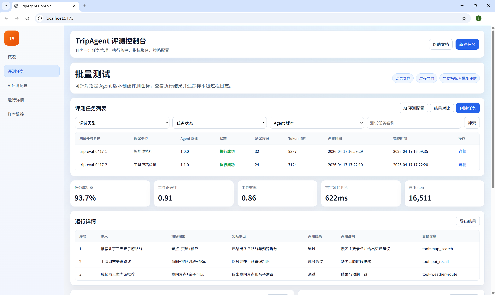
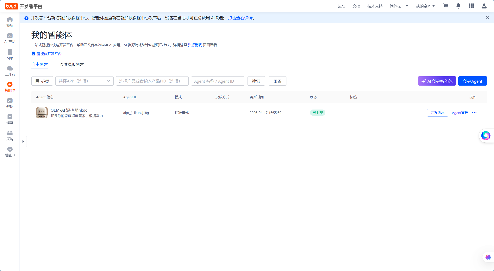
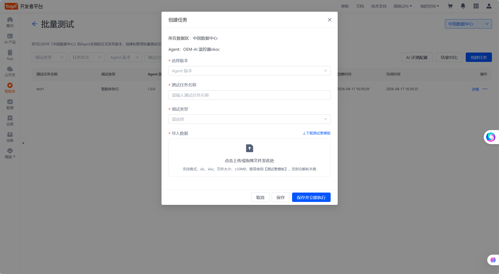
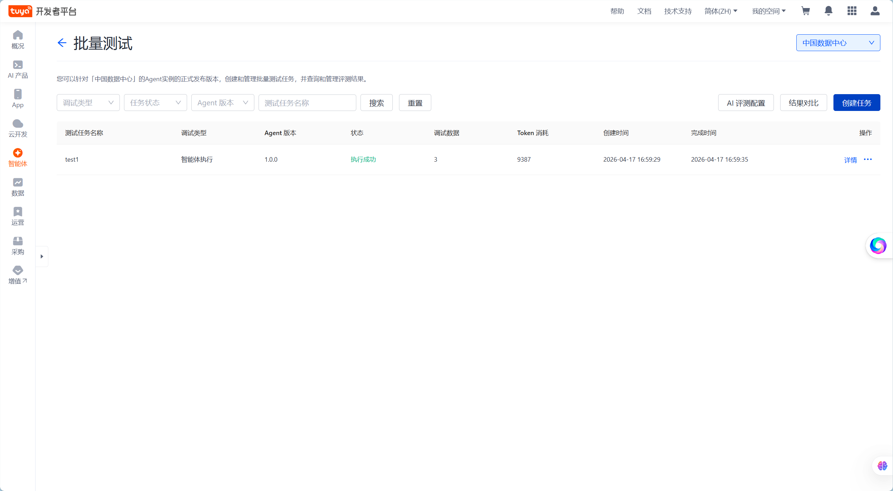
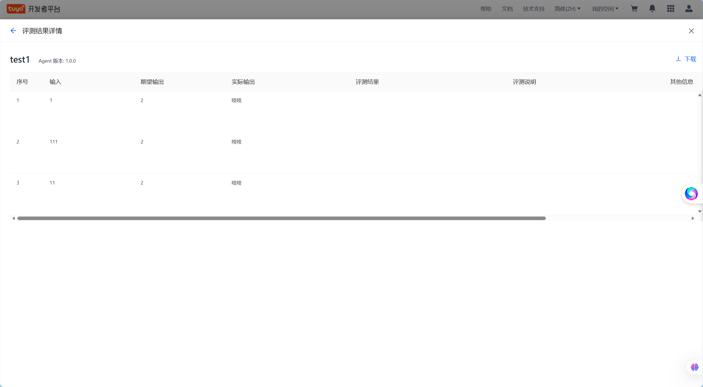

# 旅游平台 Agent 评测模块实现文档

## 1. 文档范围与页面预览

1. 评测任务创建与配置管理
2. 客观指标采集
3. 问答过程监控与问题定位
4. 多评测方法体系（结果/过程、显式/模糊、效果/安全/性能）
5. 自定义指标与组合评估策略

## 2. 目标与落地边界

### 2.1 目标

在旅游平台 Agent 首页嵌入评测能力，形成可闭环的评测系统：

1. 可创建并执行评测任务
2. 可采集并展示客观指标
3. 可查看样本级问答与工具调用过程
4. 可按多种评测模式、评测方式和评测维度执行评测
5. 可配置并复用自定义评测指标与组合策略

## 3. 系统结构

### 3.1 前端（Vue 3 + TypeScript）

1. 任务列表与创建页面
2. AI 评测配置页面（评测模型、评测提示词、策略版本）
3. 运行详情页（指标总览 + 样本结果 + 维度得分）
4. 样本监控详情（时间线与工具轨迹）

### 3.2 后端（Spring Boot）

1. 评测任务管理 API
2. 评测执行编排与运行状态管理
3. 指标计算与聚合查询
4. 问答过程日志与 SSE 事件转发
5. 评测策略引擎（模式过滤、维度聚合、阈值门禁）
6. 自定义指标注册与版本管理

### 3.3 Agent（FastAPI + LangChain）

1. 接收评测请求并执行问答
2. 输出标准化事件流：tool_call、tool_result、answer_chunk、done、error
3. 透传工具调用输入输出与耗时信息
4. 为 LLM-as-a-Judge 提供可复用上下文快照

## 4. 页面与功能清单（本部分的图片节选自tuya演示并非本项目实际效果）

### 4.1 评测任务列表页

1. 展示任务名称、Agent版本、数据集、状态、创建时间
2. 支持筛选、查看详情、启动任务
3. 支持进入运行结果页

### 4.2 创建任务页

1. 字段：任务名称、Agent版本、数据集、评测模式、指标配置
2. 动作：保存任务、保存并执行
3. 表单校验：必填字段、数据集可解析性
4. 新增策略配置：
- 评估模式：面向结果 / 面向过程
- 评估方式：显式指标 / 模糊指标
- 评估维度：效果 / 安全 / 性能
- 组合策略：维度权重、阈值、关键指标门禁

### 4.3 AI 评测配置页

1. 配置评测模型与评测提示词（支持模板与自定义）
2. 支持配置版本历史与恢复
3. 支持与任务绑定（任务可引用指定策略版本）

### 4.4 运行详情页

1. 概览卡片：成功率、总耗时、Token消耗、工具正确性、工具效率
2. 维度得分：效果维度、安全维度、性能维度
3. 样本表格：输入、期望输出、实际输出、任务完成判定、错误信息
4. 支持导出运行结果

### 4.5 样本监控详情

1. 时间线展示完整链路
2. 展示工具名、输入参数、输出摘要、单步耗时
3. 失败时展示错误阶段与原因

## 5. 数据对象

### 5.1 EvalTask

1. taskId
2. taskName
3. agentVersion
4. datasetId
5. metricSet
6. status
7. createdAt
8. evaluationMode（result/process）
9. evaluationMethod（deterministic/judge/hybrid）
10. evaluationDimensions（effectiveness/safety/performance）
11. strategyConfig（权重、阈值、门禁规则）
12. strategyVersion

### 5.2 EvalRun

1. runId
2. taskId
3. status
4. startTime
5. endTime
6. totalCount
7. successCount
8. failCount

### 5.3 QARecord

1. qaId
2. runId
3. input
4. expectedOutput
5. actualOutput
6. toolTrace
7. firstTokenLatencyMs
8. endToEndLatencyMs
9. tokenUsage
10. errorCode
11. errorMessage

### 5.4 MetricSnapshot

1. runId
2. taskCompletionRate
3. toolCorrectnessScore
4. toolEfficiencyScore
5. firstTokenP95
6. endToEndP95
7. totalTokens
8. effectivenessScore
9. safetyScore
10. performanceScore
11. judgeReason

### 5.5 EvalStrategy

1. strategyId
2. strategyName
3. metricDefinitions
4. weightConfig
5. thresholdConfig
6. version
7. createdAt

## 6. 接口清单

1. POST /api/eval/tasks
2. GET /api/eval/tasks
3. GET /api/eval/tasks/{taskId}
4. GET /api/eval/tasks/{taskId}/runs
5. GET /api/eval/tasks/{taskId}/runs/compare（支持 changedOnly）
6. PUT /api/eval/tasks/{taskId}
7. POST /api/eval/tasks/{taskId}/start
8. GET /api/eval/runs/{runId}
9. GET /api/eval/runs/{runId}/records
10. GET /api/eval/runs/{runId}/metrics
11. GET /api/eval/runs/{runId}/stream
12. POST /api/eval/strategies
13. GET /api/eval/strategies
14. GET /api/eval/strategies/{strategyId}
15. POST /api/eval/strategies/{strategyId}/versions
16. POST /api/eval/metrics/custom
17. POST /api/eval/tasks/{taskId}/runs/compare/export
18. GET /api/eval/exports/{exportId}
19. GET /api/eval/exports/{exportId}/download
20. GET /api/eval/exports
21. POST /api/eval/exports/{exportId}/retry
22. DELETE /api/eval/exports/{exportId}
23. POST /api/eval/exports/batch-delete
24. GET /api/eval/exports/{exportId}/audits
25. GET /api/eval/exports/consistency-check
26. GET /api/eval/exports/metrics

## 7. 核心流程说明

### 7.1 流程 A：创建评测任务

1. 用户填写任务配置并提交
2. 后端校验并保存任务
3. 返回 taskId，状态为 Ready

### 7.2 流程 B：执行任务与采集指标

1. 用户触发执行，后端生成 runId
2. 按测试集逐条调用 Agent
3. 后端接收事件流并同步记录：
- 回答内容
- 工具调用轨迹
- 时延与 Token
4. 每条样本落库 QARecord
5. run 结束后聚合写入 MetricSnapshot

### 7.3 流程 C：问答监控与排障

1. 在运行详情中选择样本
2. 查看调用时间线与工具轨迹
3. 失败样本查看错误阶段和错误信息
4. 定位问题后回到任务配置迭代

## 8. 指标定义

### 8.1 工具正确性

1. 工具选择正确率
- 是否覆盖必需工具集合

2. 输入参数准确率
- 参数命中率（仅在工具选择正确时计算）

3. 输出准确性
- 工具输出与真值匹配度（仅在工具选择正确时计算）

### 8.2 工具效率

1. 冗余工具调用率
- 不必要调用次数 / 总调用次数

2. 工具频率惩罚
- 超过阈值的重复调用惩罚项

### 8.3 任务完成与性能成本

1. taskCompletionRate
2. firstTokenLatencyMs 
3. endToEndLatencyMs 
4. timeoutRate
5. promptTokens、completionTokens、totalTokens

## 9. 参考页面借鉴点

参考链接：
https://developer.tuya.com/cn/docs/iot/ai-agent-evaluation?id=Kenth7s0bxavo

可借鉴能力：

1. 批量测试任务入口与任务列表管理
2. 创建任务时支持“保存并立即执行”
3. 结果页采用“样本表格 + 详情查看”
4. 展示 Token 消耗明细
5. 支持人工标注通过/失败与备注

## 10. 实现内容

1. 可创建并管理评测任务
2. 可执行任务并产生 run 结果
3. 可配置评估模式（结果/过程）并生效
4. 可配置评估方式（显式/模糊）并生效
5. 可查询并展示工具正确性、工具效率、耗时与 Token 指标
6. 可展示效果/安全/性能三维度得分
7. 可创建并复用至少 1 个自定义指标与 1 套组合策略

## 11. 分步交付记录

1. [Step1: MVP 范围冻结](docs/step1-mvp-freeze.md)
2. [Step2: DB骨架与实体仓储](docs/step2-db-skeleton.md)
3. [Step3: 任务与运行基础API](docs/step3-task-run-api.md)
4. [Step4: 执行编排+records/metrics/stream](docs/step4-run-execution-records-metrics-stream.md)
5. [Step5: 策略版本与自定义指标](docs/step5-strategy-custom-metric.md)
6. [Step6: 前端真实联调](docs/step6-frontend-live-integration.md)
7. [Step7: 数据集解析与任务运行历史](docs/step7-dataset-and-task-runs.md)
8. [Step8: 任务运行分页与状态筛选](docs/step8-task-run-pagination.md)
9. [Step9: 运行对比页](docs/step9-run-compare.md)
10. [Step10: 对比导出与变化样本筛选](docs/step10-compare-export-and-filter.md)
11. [Step11: 任意运行对比与指标排序高亮](docs/step11-compare-enhancement.md)
12. [Step12: 异步导出任务与下载](docs/step12-async-export.md)
13. [Step13: 导出任务列表与状态筛选](docs/step13-export-list.md)
14. [Step14: 导出失败重试与前端闭环](docs/step14-export-retry.md)
15. [Step15: 导出任务自动清理与删除接口](docs/step15-export-cleanup.md)
16. [Step16: 导出任务批量删除前端能力](docs/step16-export-batch-delete-ui.md)
17. [Step17: 导出任务持久化入库](docs/step17-export-task-persistence.md)
18. [Step18: 导出任务与文件一致性巡检修复](docs/step18-export-consistency-repair.md)
19. [Step19: 导出任务操作者与审计能力](docs/step19-export-audit-and-operator.md)
20. [Step20: 导出任务监控统计与告警](docs/step20-export-monitoring-and-alert.md)
21. [Step21: Bradley-Terry 多模型评测（仅后端 MVP）](docs/step21-bt-evaluation.md)
22. [Step22: 评测平台前端 BT 接入 + 数据集上传](docs/step22-bt-frontend-integration.md)
23. [Step23: 前端 vue-router 拆页面 + 模型 ID 下拉化](docs/step23-router-and-catalog.md)
8. 可查看样本级问答过程与工具轨迹
9. 可完成至少一次端到端评测闭环

## 11. 实现方案

### 11.1 按评估模式划分

1. 面向结果（Result-Oriented）
- 仅关注输入与最终输出。
- 适用指标：任务完成率、答案准确率、答案完整率、非空回答率。
- 数据依赖：input、actualOutput、expectedOutput。

2. 面向过程（Process-Oriented）
- 关注中间推理与工具调用轨迹。
- 适用指标：工具正确性、工具效率、步骤连贯性、中间错误率。
- 数据依赖：toolTrace、eventTimeline、errorStage。

### 11.2 按评估方式划分

1. 显式指标（Deterministic）
- 可直接计算，适合作为门禁指标。
- 将会纳入：
- Token 消耗
- 工具调用正确率
- 任务成功率
- 首字延迟与端到端响应时间

2. 模糊指标（LLM-as-a-Judge）
- 评价标准相对主观，输出 score + reason。
- 将会纳入：
- 推理质量
- 输出内容准确性
- 幻觉程度
- 交互体验

### 11.3 按评估维度划分

1. 效果维度（Effectiveness）
- 关注是否有效、准确、完整。
- 指标：taskCompletionRate、answerAccuracy、answerCompleteness。

2. 安全维度（Safety）
- 关注是否包含不安全或有害内容。
- 指标：safetyViolationRate、policyComplianceScore。

3. 性能维度（Performance）
- 关注是否流畅、是否出现长时间等待。
- 指标：firstTokenLatencyMs、endToEndLatencyMs、timeoutRate。

### 11.4 组合评估策略

支持“维度权重 + 模式过滤 + 指标阈值”的组合策略。

1. 组合策略示例（旅游平台场景）
- 总分 = 0.5 * 效果 + 0.2 * 安全 + 0.3 * 性能
- 结果模式任务：仅启用结果类指标。
- 过程模式任务：启用工具与轨迹类指标。

2. 通过门槛建议
- 必须同时满足：
- 总分 >= 阈值
- 安全维度 >= 最低阈值
- 关键显式指标全部通过

### 11.5 自定义指标扩展能力

1. 支持用户创建自定义指标
- 定义指标名称、类型（显式/模糊）、输入字段、评分逻辑、阈值。

2. 支持用户配置指标组合
- 为不同任务配置不同 metricSet 与权重。

3. 支持版本化管理
- 指标定义与组合策略保存版本，支持回滚与复现。

## 12. 第一步交付物（范围冻结）

为保障当天开发可控，已完成第一步的完整交付文档（MVP 范围、接口冻结、字段冻结、验收清单、排期与风险降级）：

- [Step 1 交付物：MVP 范围冻结](docs/step1-mvp-freeze.md)

建议所有开发改动以该文档为单一事实来源（SSOT），超出 P0 范围的功能统一延后到下一迭代。

## 13. 第二步交付物（数据库骨架）

已完成第二步交付文档（数据库配置、建表脚本、实体、枚举、仓库层）：

- [Step 2 交付物：数据库骨架与持久化层](docs/step2-db-skeleton.md)

## 14. 第三步交付物（任务与运行 API）

已完成第三步交付文档（任务管理 API、运行管理 API、异常处理与交互约定）：

- [Step 3 交付物：任务与运行 API](docs/step3-task-run-api.md)

## 15. 第四步交付物（执行编排与运行查询）

已完成第四步交付文档（异步执行、样本落库、指标聚合、SSE 运行流）：

- [Step 4 交付物：执行编排与运行查询](docs/step4-run-execution-records-metrics-stream.md)

## 16. 第五步交付物（策略版本与自定义指标）

已完成第五步交付文档（策略 API、版本 API、自定义指标 API 与评分流程接入）：

- [Step 5 交付物：策略版本与自定义指标](docs/step5-strategy-custom-metric.md)

## 17. 第六步交付物（前端真实联调）

已完成第六步交付文档（任务/运行/策略/自定义指标前端联调与 SSE 监控）：

- [Step 6 交付物：前端真实联调](docs/step6-frontend-live-integration.md)

